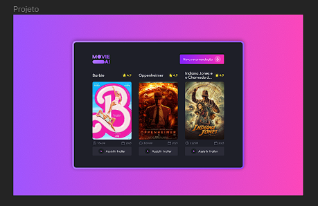

<h1 align="center">Desafio 30 - Plataforma de filmes</h1>

Plataforma de recomendações de filmes e séries.  

  <a href="#-tecnologias">Tecnologias</a>&nbsp;&nbsp;&nbsp;|&nbsp;&nbsp;&nbsp;
  <a href="#-projeto">Projeto</a>&nbsp;&nbsp;&nbsp;|&nbsp;&nbsp;&nbsp;
  <a href="#-layout">Layout</a>&nbsp;&nbsp;&nbsp;|&nbsp;&nbsp;&nbsp;
  <a href="#-aprendizado">Aprendizado</a>&nbsp;&nbsp;&nbsp;|&nbsp;&nbsp;&nbsp;
  <a href="#-licença">Licença</a>

  

 

  

---

## 🚀 Tecnologias

Esse projeto foi desenvolvido com as seguintes tecnologias:

- HTML e CSS
- Javascript
- API
- Git e Github
- Figma 
 
---

## 💻 Projeto

O 30º desafio proposto pela Rocketseat consiste na criação de uma plataforma para recomendações de filmes e séries.

---
## 🔖 Layout

Você pode visualizar o layout do projeto através [Desse Link](https://www.figma.com/file/jpnv5DPkdj21KvHYUwLmth/Recomenda%C3%A7%C3%A3o-de-Filme-com-IA-%E2%80%A2-Desafio-30-(Community)?node-id=3%3A376&mode=dev). É necessário ter conta no [Figma](https://figma.com) para acessá-lo.

---
## 📑 Aprendizado

Durante o desenvolvimento desse projeto o maior aprendizado ficou como realizar várias sub requisições para uma API, buscando primeiro o filme que queríamos, pelo ID que vinha dela, e depois buscar nesse ID trailer, ano de lançamento, tempo de duração e afins.  
Na parte de Javascript esse projeto serviu para fixar e reforçar as funções assíncronas.  
Já no CSS foi para reforçar a parte de gradientes, no botão e background dessa aplicação, e fazer uma borda utilizando um outro background com position relative e absolute.

---

## 📝 Licença

Esse projeto está sob a licença MIT.

---

Feito com ♥ por Gustavo Zamai